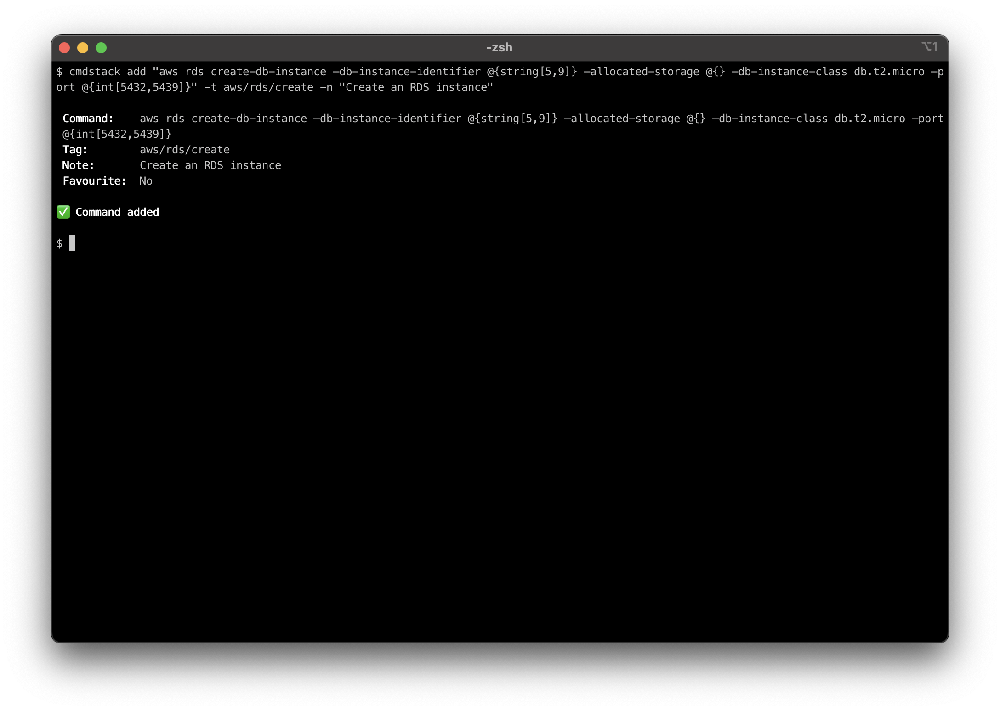

# CmdStack

CmdStack is a CLI command management solution designed to help developers avoid the hassle of maintaining scattered Notepad or text files full of command stashes. It provides a unified CLI and GUI experience to store, manage, and execute your favourite CLI commands with ease. Currently available on MacOS, CmdStack streamlines your CLI workflow and allows you to focus on what matters.


## Features

CmdStack has the following features:

-   **Hierarchical Organization:** Group similar commands into hierarchical folders by labelling them with tags
-   **Easy Search:** Search for the command you need by the command contents and/or tag
-   **Instant Execution:** Run your commands directly from both of our applications, allowing you to execute your commands efficiently in the terminal of your choice
-   **Dynamic Command Customization** Increase the flexibility of your commands by dynamically customizing them using random value generation and interactive input
    -   _Random Value Generation:_ Forget about searching for online generators for random UUIDs, integers, or strings – CmdStack can dynamically generate random values within your commands on demand
    -   _Interactive Input:_ Adapt your commands on the fly with blank placeholders that you can fill in on each use
-   **Import/Export:** Easily import and export your entire command stack from the CLI in JSON format – your data always stays under your control
-   **No Telemetry:** CmdStack collects no data and thus requires no internet access

### Dynamic Command Customization

One of the standout features of CmdStack is its ability to dynamically customize commands saved in your stack through the use of random value generation and interactive input. This has the benefit of increasing the flexibility of your saved commands. You can leverage this feature by using the following syntax:

-   **Non-Blank Parameters:** (For random value generation)
    -   **String:** `@{string[min,max]}`
    -   **Integer:** `@{int[min,max]}`
    -   **Boolean:** `@{bool}`
    -   **UUID:** `@{uuid}`
-   **Blank Parameter:** `@{}` (For interactive input)

For non-blank parameters, CmdStack will dynamically substitute placeholders with random strings, integers, booleans, etc. in the selected command.

For blank parameters, you will be asked for input when selecting a command. The inputs you provide will replace the blank parameter in the command.

For `@{string[min,max]}` and `@{int[min,max]}`, the `[min,max]` arguments are optional. If they are excluded, the default is `[5,10]`.

#### Example

Suppose you saved the following command in CmdStack.

```
aws rds create-db-instance –db-instance-identifier @{string[5,9]} –allocated-storage @{} –db-instance-class db.t2.micro –port @{int[5432,5439]}
```

This command has two non-blank parameters and one blank parameter. The non-blank parameters are:

1. `@{string[5,9]}` - A string parameter that is between 5 and 9 characters long
2. `@{int[5432,5439]}` - An integer parameter that lies between 5432 and 5439

When this command is viewed in the GUI or selected in the CLI, the non-blank parameters will be replaced with randomly generated values and the blank parameter will be populated with user input. If the value "256" is supplied for the blank parameter, the following might be the resultant command:

```
aws rds create-db-instance –db-instance-identifier 230wZGW –allocated-storage 256 –db-instance-class db.t2.micro –port 5439
```

## Usage

### CLI

The CmdStack CLI provides a set of operations to manage your command stack. Below is the help text generated by the CLI:

```
$ cmdstack -h
Usage: cmdstack <COMMAND>

Commands:
  add     Add a command to your stack
  update  Update a command in your stack
  delete  Delete a command in your stack
  search  Search for a command in your stack
  export  Export stack to a JSON file
  import  Import stack from a JSON file
  config  Modify the config values
  help    Print this message or the help of the given subcommand(s)

Options:
  -h, --help     Print help
  -V, --version  Print version
```

#### Adding a Command

This is done using the `add` command. The help text for this command as as follows:

```
$ cmdstack add -h
Add a command to your stack

Usage: cmdstack add [OPTIONS] [COMMAND]

Arguments:
  [COMMAND]  The command to add to your stack

Options:
  -n, --note <NOTE>  Notes relating to the command
  -t, --tag <TAG>    The tag for the command
  -f, --favourite    Mark the command as favourite
  -h, --help         Print help
```

You can specify the command you wish to save directly in the CLI command along with any desired options:



Alternatively, if you wish to add a command interactively, you can simply type `cmdstack add` and fill out the prompts:


#### Searching for a Command

This is done using the `search` command. The help text for this command is as follows:

```
$ cmdstack search -h
Search for a command in your stack

Usage: cmdstack search [OPTIONS] [COMMAND]

Arguments:
  [COMMAND]  The text used to filter by command when searching

Options:
  -t, --tag <TAG>  The text used to filter by tag when searching
  -r, --recent     Display commands in order of most recent use
  -f, --favourite  Only display favourite commands
  -h, --help       Print help
```

You can specify the search parameters directly in the CLI command. Alternatively, you could exclude them (i.e. only run `cmdstack search`) and enter your search parameters using the prompts.

After you have entered your search parameters, you will be presented with a list of matching commands. Navigate the list and select your desired command. If the command contains blank parameters, you will be prompted to fill them in.

> **_NOTE:_** The blank parameters will be numbered starting from 1 (`@{1}`, `@{2}` and so on). This is done to help you locate where your input will be substituted into the selected command.

Once you have populated every blank parameter, you will be presented with the following inputs:

1. **Edit Command:** - This gives you the option to manually adjust your command, if required
2. **Select an action:** - Deciden to either copy the generated command to your clipboard or execute it directly in the terminal.

The following gifs show two examples of searching for the same command. The first gif uses CLI arguments while the second uses the search parameter prompts.


#### Updating and Deleting Commands

The `update` and `delete` commands are built on top of the `search` command. Thus, the inputs required are identical to `cmdstack search`.

The two gifs show an example of updating and deleting a command respectively.


## Installation

You can always find the latest release on our [Releases Page](https://github.com/danyal002/cmd-stack/releases/latest). The release assets include:

-   **GUI App:** A universal DMG named `CmdStack-GUI_<tag>.dmg`
-   **CLI App:** Two builds are available depending on your CPU architecture:
    -   `cmdstack-cli-x86_64-apple-darwin_<tag>.zip`
    -   `cmdstack-cli-aarch64-apple-darwin_<tag>.zip`

### GUI Installation

Installing the GUI is as simple opening the DMG and following the instructions to install.

### CLI Installation

To make installing the CLI as easy as possible, you can use the following bash script. This script will:

1. Detect your CPU architecture.
2. Query the latest release from GitHub.
3. Download the correct CLI zip asset.
4. Unzip it.
5. Move the `cmdstack` binary to `/usr/local/bin`.
6. Clean up the downloaded files.

#### `install-cli.sh`

```bash
#!/usr/bin/env bash
arch=$(uname -m)
if [ "$arch" == "x86_64" ]; then
    target="cli-x86_64-apple-darwin"
elif [ "$arch" == "arm64" ] || [ "$arch" == "aarch64" ]; then
    target="cli-aarch64-apple-darwin"
else
    echo "Unsupported architecture: $arch"
    exit 1
fi

# Get the latest release download URL for the CLI asset matching your architecture
latest_release_url=$(curl -s https://api.github.com/repos/danyal002/cmd-stack/releases/latest \
  | grep "browser_download_url" | grep "$target" | cut -d '"' -f 4)

if [ -z "$latest_release_url" ]; then
    echo "Could not find the latest release asset for $target"
    exit 1
fi

echo "Downloading CLI asset from: $latest_release_url"
curl -L -o cmdstack.zip "$latest_release_url"

echo "Unzipping..."
unzip -o cmdstack.zip -d cmdstack_temp

echo "Installing the CLI binary to /usr/local/bin (requires sudo)..."
sudo mv cmdstack_temp/cmdstack /usr/local/bin/cmdstack

echo "Cleaning up..."
rm -rf cmdstack_temp cmdstack.zip

echo "Installation complete! Make sure /usr/local/bin is in your PATH."
```

**Usage:**  

Make the script executable and run it from your terminal:

```bash
chmod +x install-cli.sh
./install-cli.sh
```

## How to Contribute

CmdStack is open-source and welcomes contributions from the community!

Here's how you can get involved:

-   **Request a new feature:** Use GitHub issues and label your issue with [`feature-request`](https://github.com/danyal002/cmd-stack/labels/feature-request). Please search existing feature requests before making a new one.
-   **Report a bug:** Use GitHub issues and label your issue with [`bug`](https://github.com/danyal002/cmd-stack/labels/bug). Please search existing bug reports before making a new one.
-   **Write code:** Please do your dev work on a fork of this repository. Once finished, create a PR containing a detailed description of the changes (including screenshots, if possible).

As always, please be respectful in your communication.

## License

Please view the provided license file.
